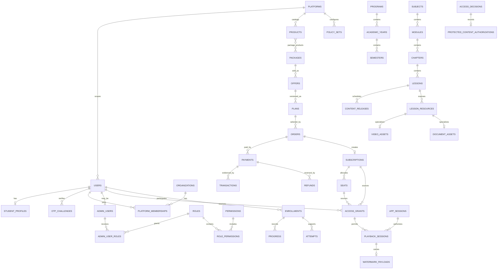

# Medical E-Learning Backend ERD v1

> **Legacy logical ERD:** Review [Postgres/Supabase Schema Alignment Review](postgres-supabase-schema-alignment-review.md) before writing migrations. Future physical schema work must follow canonical brand-scope alignment while legacy platform terminology remains compatibility-only.

> This ERD remains logical/legacy until the blockers in the [Schema Decision Register](schema-decision-register.md) are resolved.

## Scope and invariants

This is a logical ERD, not SQL or a migration. `platforms` contains the two isolation boundaries: **Medway** and **Elite**. Every persisted table other than `platforms` carries `platform_id`; every relationship must join within that same platform. A Medway row must never authorize, price, enroll, administer, or expose Elite content.

Accounts are separate per platform. `payment`, `subscription`, `seat`, `access_grant`, `enrollment`, `device`, `app_session`, `playback_session`, and `progress` are intentionally separate records. An active `access_grant` is the authorization input; payment evidence and enrollment do not grant access on their own.

## Text ERD

All tables use `id` as PK plus `created_at`; mutable tables also have `updated_at`. `platform_id` is required unless noted otherwise.

### Platform and identity

| Table | Key fields and foreign keys | Cardinality / constraints |
|---|---|---|
| `platforms` | `id`, `code`, `default_timezone` | `code` is unique: `medway` or `elite`; only table without `platform_id`. |
| `users` | `platform_id`, `email`, `status` | One platform has many users; unique `(platform_id, normalized_email)`. |
| `student_profiles` | `platform_id`, `user_id` → users | One user has zero or one student profile. |
| `otp_challenges` | `platform_id`, `user_id` nullable → users, `purpose`, `status`, `expires_at` | OTP proof is distinct from the user and session. |
| `organizations` | `platform_id`, `legal_name`, `status` | One platform has many organizations. |
| `platform_memberships` | `platform_id`, `user_id` → users, `organization_id` nullable → organizations | Membership may authorize organization administration; it never grants learning access. |
| `admin_users` | `platform_id`, `user_id` → users, `status` | Administrative identity is separate from student profile. |
| `roles`, `permissions` | `platform_id`, `code`, `status` | Both are platform-scoped. |
| `role_permissions` | `platform_id`, `role_id` → roles, `permission_id` → permissions | Unique `(platform_id, role_id, permission_id)`. |
| `admin_user_roles` | `platform_id`, `admin_user_id` → admin_users, `role_id` → roles | Supports role expiry/revocation. |

### Commercial and access

| Table | Key fields and foreign keys | Cardinality / constraints |
|---|---|---|
| `products` | `platform_id`, `code`, `product_type`, `status` | Educational/catalog unit; unique `(platform_id, code)`. |
| `packages` | `platform_id`, `code`, `status` | Commercial grouping of products. |
| `package_products` | `platform_id`, `package_id` → packages, `product_id` → products | Normalizes package-to-product many-to-many membership. |
| `offers` | `platform_id`, `package_id` → packages, `code`, `audience_type` | Sellable presentation of one package. |
| `plans` | `platform_id`, `offer_id` → offers, `version`, `effective_from/to`, `policy_set_id` → policy_sets | Immutable effective-dated commercial terms. |
| `policy_sets` | `platform_id`, `name`, `version`, `document_reference` | Versioned reference for unresolved commercial/security rules. |
| `promotions` | `platform_id`, `policy_set_id` → policy_sets, `starts_at/ends_at` | Benefit and eligibility are policy-defined. |
| `orders` | `platform_id`, `user_id` nullable → users, `organization_id` nullable → organizations, `plan_id` → plans, `terms_snapshot` | Exactly one commercial owner: user or organization. |
| `payments` | `platform_id`, `order_id` → orders, `status`, `amount`, `currency` | Payment is independent from subscription/access. |
| `transactions` | `platform_id`, `payment_id` → payments, `provider_reference`, `status` | Provider/manual transaction evidence. |
| `refunds` | `platform_id`, `payment_id` → payments, `policy_set_id` → policy_sets, `status` | Refund lifecycle is separate from payment history. |
| `subscriptions` | `platform_id`, `order_id` → orders, `plan_id` → plans, `owner_user_id` nullable, `organization_id` nullable, `terms_snapshot` | One owner reference; lifecycle does not directly authorize content. |
| `seats` | `platform_id`, `subscription_id` → subscriptions, `assigned_user_id` nullable → users, `status` | Organization-owned subscription allocates seats; one active assignee per seat. |
| `access_grants` | `platform_id`, `user_id` → users, `source_type/id`, `scope_type/id`, `status`, `valid_from/until` | Explicit, revocable authorization; source is subscription, seat, or approved exception. |

### Learning and scheduled release

| Table | Key fields and foreign keys | Cardinality / constraints |
|---|---|---|
| `programs`, `academic_years`, `semesters` | `platform_id`; year → program; semester → academic year | Academic hierarchy and calendar. |
| `subjects`, `modules`, `chapters`, `lessons` | `platform_id`; subject → program/year/semester; module → subject; chapter → module; lesson → chapter | Ordered content hierarchy. |
| `content_releases` | `platform_id`, `lesson_id` → lessons, `available_from/until`, `timezone`, `status` | Platform-calendar release window; valid grant does not bypass release time. |
| `lesson_resources` | `platform_id`, `lesson_id` → lessons, `resource_type`, `sequence` | Types: `video`, `document`, `quiz`, `link`, `file`. |
| `video_assets`, `document_assets` | `platform_id`, `lesson_resource_id` → lesson_resources, `storage_reference`, `delivery_policy_set_id` → policy_sets | Specialized protected-resource details. |
| `quizzes`, `assessments`, `questions` | `platform_id`; quiz → lesson/resource and assessment; question → assessment | Assessment behavior remains policy-driven. |
| `attempts`, `attempt_answers` | `platform_id`; attempt → assessment, user, enrollment; answer → attempt/question snapshot | Attempt evidence is historical and versioned. |
| `enrollments` | `platform_id`, `student_user_id` → users, program/subject target | Participation record, not commercial authorization. |
| `progress` | `platform_id`, `enrollment_id` → enrollments, `lesson_id` → lessons | Completion evidence is distinct from video views. |

### Security and operations

| Table | Key fields and foreign keys | Cardinality / constraints |
|---|---|---|
| `devices` | `platform_id`, `user_id` → users, `fingerprint_reference`, `trust_status` | Privacy-safe device reference; not a session or seat. |
| `device_replacements` | `platform_id`, `user_id`, old/new device IDs → devices, `otp_challenge_id` → otp_challenges | Policy-controlled replacement evidence. |
| `app_sessions` | `platform_id`, `user_id` → users, `device_id` nullable → devices, `expires_at`, `status` | Authentication session only; no implicit course access. |
| `playback_sessions` | `platform_id`, `app_session_id` → app_sessions, `device_id`, `access_grant_id` → access_grants, `asset_id` | Short-lived protected delivery authorization. |
| `access_decisions` | `platform_id`, `user_id`, `access_grant_id` nullable, resource and reason fields | Immutable allow/deny evidence. |
| `protected_content_authorizations` | `platform_id`, `access_decision_id` → access_decisions, `delivery_policy_set_id` → policy_sets | Records an evaluated protected-delivery decision. |
| `watermark_payloads` | `platform_id`, `playback_session_id` → playback_sessions, template reference, issued timestamp | Minimum-necessary generated watermark metadata only. |
| `audit_logs`, `analytics_events`, `security_events`, `admin_actions` | `platform_id`, actor/resource/correlation fields as applicable | Operational evidence; analytics is never the financial/access source of truth. |

## Mermaid ERD

## Relationship rules

- Packages and products are many-to-many through `package_products`; offers sell packages and plans version offer terms.
- Payments and transactions evidence financial state only. Subscription activation and access-grant issuance are separate, auditable domain transitions.
- A seat is capacity under an organization-owned subscription. It has at most one active learner assignment; it is never a device identity.
- An access grant has a user, a bounded resource scope, a source, and validity/revocation fields. Enrollment stores participation, while playback sessions store protected delivery activity.
- Content releases use explicit platform-timezone windows. Active subscription or grant state cannot open unreleased content.
- Video/document assets specialize a resource; a resource’s type determines which specialized row is valid. A playback event does not mark `progress` complete.
- App sessions, devices, and playback sessions have independent expiry/revocation lifecycles. Dynamic watermarks use generated metadata, never raw authentication credentials or payment data.

## Tables that must include `platform_id`

All tables above except `platforms`, including join tables (`package_products`, `role_permissions`, `admin_user_roles`), polymorphic authorization tables, subtype tables, attempts/answers, and all event/log tables. Every FK relationship must be platform-consistent; use composite foreign-key/unique constraints or equivalent application/database enforcement so an identifier from Elite cannot be referenced by a Medway row.

## Audit-required actions

- User/admin status, OTP verification, organization/membership, role, and permission changes.
- Offer, plan, policy-set, and promotion publication or terms changes.
- Order, payment, transaction, refund, subscription, seat, and access-grant issue/revoke/suspend changes.
- Content-release and protected-asset delivery-policy changes.
- Device replacement, session revocation, denied access decisions, and all admin actions.

## Tables that must not be physically deleted

- Financial: `orders`, `payments`, `transactions`, `refunds`, `subscriptions`, and historical seat assignments.
- Security/authorization: `access_grants`, `app_sessions`, `playback_sessions`, `device_replacements`, `access_decisions`, `watermark_payloads`, `audit_logs`, `security_events`, and `admin_actions`.
- Academic evidence: `enrollments`, `progress`, `attempts`, and `attempt_answers`.

Use status, revocation/end timestamps, archival, retention rules, or legally governed anonymization instead of ordinary deletion.

## Unresolved decisions affecting ERD evolution

- Tax, invoices, legal entities, currencies, discounts, and promotion stacking.
- Organization invitation/offboarding, seat transfer, and commercial ownership migration.
- Refund eligibility, partial refunds, approval workflow, and access-revocation timing.
- Device/concurrency/view-limit semantics; DRM, downloads, and watermark retention.
- Assessment versioning, question randomization, grading, certificates, and answer retention.
- Privacy/retention/erasure obligations and regional hosting.
- Future cohort- or enrollment-relative release audiences; v1 intentionally uses only platform-calendar releases.
